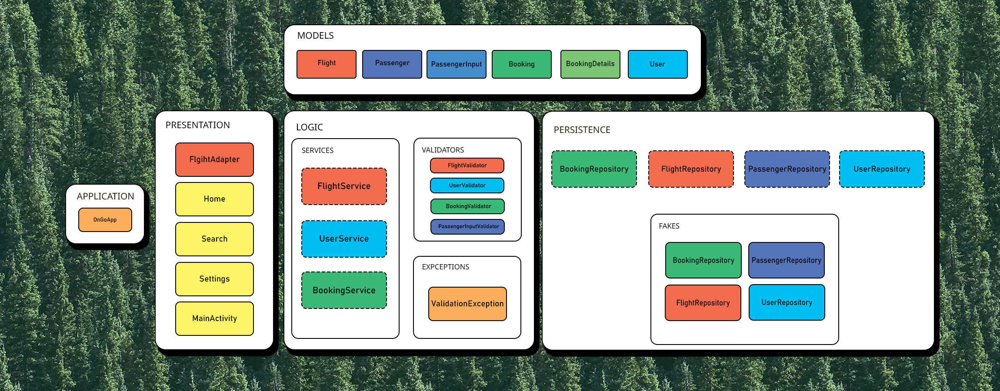

git# Architecture Overview




## General Description

* **Application**
* **Presentation**
* **Logic**
* **Models**
* **Persistence**

Each layer adheres to having a single repsonsibility and communicates only with itself and the layers underneath it (some acceptable cases)

## Layer Responsibilities 

#### 1. Application 
* Contains the entry point (OnGoApp.java).
* Responsible for wiring dependencies and launching the application.
* Does not contain business logic

#### 2. Presentation
* UI layer
* Includes:
  * `BookingAdapter`
  * `FlightAdapter`
  * Fragments (Tabs like Home, Search, Setting)
  * `MainActivity`
* Responsible for:
  * Displaying list of Flight
  * Flight Details
  * Displays booked flight and its details
  * Talks to logic layer when data (like flight details) is needed
  
UserInfoFragment does not store any user data, at the moment we only handle one user and their booking. Single user can book multiple flight under different people's name but it is the same user.

#### 3. Logic
* Business layer.
* Includes: 
    * `FlightService`
    * `UserService`
    * `BookingService`
    * Validators
    * Exceptions

This layer handles the brunt of the workflow ochastration, it communicates with the repositories of our system to fetch and store data at the request of the presentation layer and validates the data being passed through. This class additionally throws domain specific exceptions to the presentation layer.

#### 4. Models
* Domain entities:
  * `User`
  * `Flight`
  * `Booking`
  * `Booking details`
  * `Passenger`
  * `PassengerInput`
* Representation of the data needed for OnGo.

`BookingDetails` is a object class created to prevent a data clump code smell, this causes it to be tightly coupled with the flight, booking, and passenger classes.

#### 5. Persistence
* Data access layer.
* Structure:

  * Repository interfaces: `BookingRepository`, `PassengerRepository`, `FlightRepository`, `UserRepository`
  * Fake implementations: `FakeBookingRepository`, `FakePassengerRepository`, `FakeUserRepository`, `FakeFlightRepository`
  * Real database implementations: n/a

Fakes are stub implementations of the interfaces made for testing.

## Legend

### Color Meaning (Interaction / Flow)

Colors represent logical groupings and interaction flow between components:
**examples:**
* **Light Blue** – User-related components
  (`User`, `UserValidator`, `UserRepo`, etc.)

* **Yellow** – UI components
  Represent UI pages within our system

The colors consistency visually communicates which components collaborate most closely.


### Border Meaning

* **Solid Border** → Concrete class
* **Dotted Border** → Interface
---

### Group Boxes

* **Large labeled boxes** (Application, Presentation, Logic, Models, Persistence)
  → Architectural layers/packages

* **Subgroup boxes** (services, validators,exceptions, fakes)
  → Logical categorization within a layer/subpackage


## Dependency Direction

Dependency flow:

```
Presentation
    ↓
Logic (via interfaces)
    ↓
Persistence (via interfaces)
```

Models are shared across layers for data transfer
